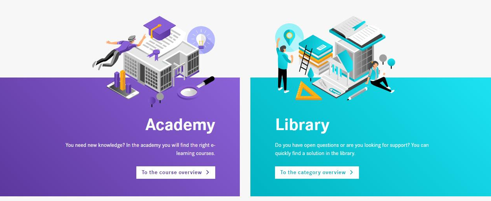

# Daimler Protics Learningplatform



In all the information jungle of our time, one often does not find the relevant things. The Learninplatform is a manageable place where you can find exactly the information that is useful and necessary for your work.

Depending on the specific question and initial situation, the Library contains specific user-oriented information. The Academy offers guided learning tours, which, depending on the knowledge and role, picks up the learner where he is
The goals are structre content according to the following principles:

- target group- and role-based
- needs-based, small-scale and modular
- including change needs in your organization

___

## Quickstart Guide


1. To get started quickly and start coding on the frontend you can use the local docker-compose:

    ```bash
    cd server
    docker-compose up -d
    ```

2. [Setup Wordpress](./docs/backend-setup.markdown) 
   
3. Start the client

    ```bash
    cd client
    npm install 
    npm start
    ```

4. Read the docs to get familiar with different content types and custom types in Wordpress
  [Documentation](./docs/README.md)

## Contributing

We welcome any contributions.  
If you want to contribute to this project, please read the [contributing guide](CONTRIBUTING.md).  

## Code of Conduct

Please read our [Code of Conduct](CODE_OF_CONDUCT.md) as it is our base for interaction.

## License

This project is licensed under the [MIT LICENSE](LICENSE).

## Provider Information

Please visit <https://www.daimler-protics.com/legal/impressum.html> for information on the provider.

Notice: Before you use the program in productive use, please take all necessary precautions,
e.g. testing and verifying the program with regard to your specific use.
The program was tested solely for our own use cases, which might differ from yours.
